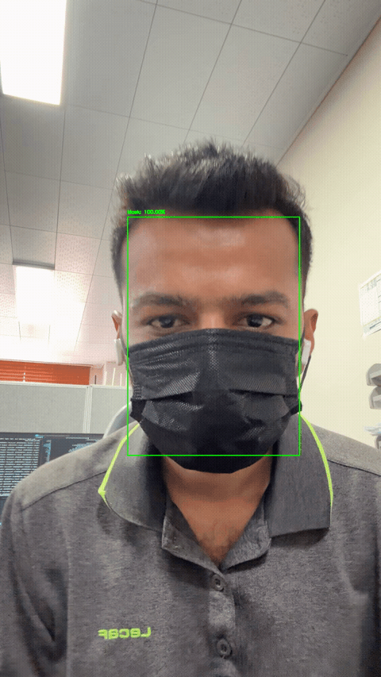
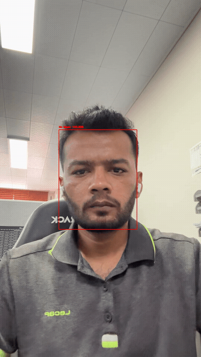
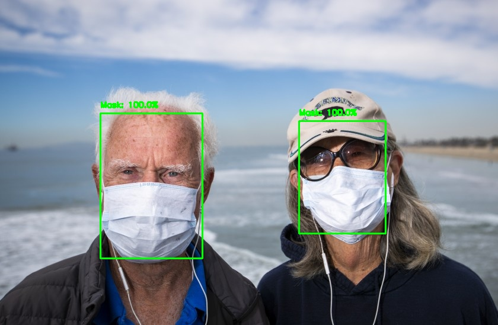
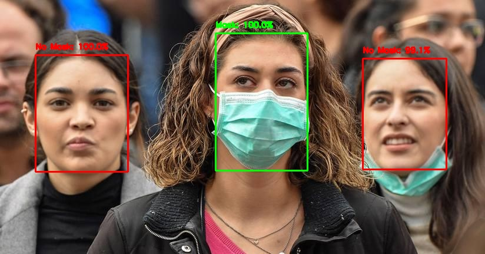
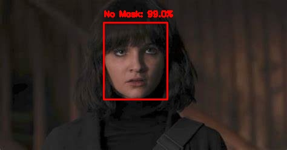
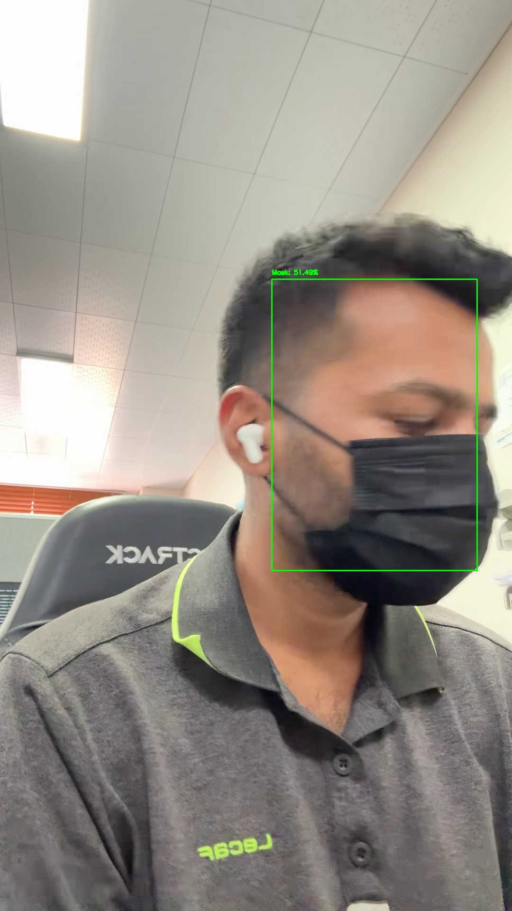
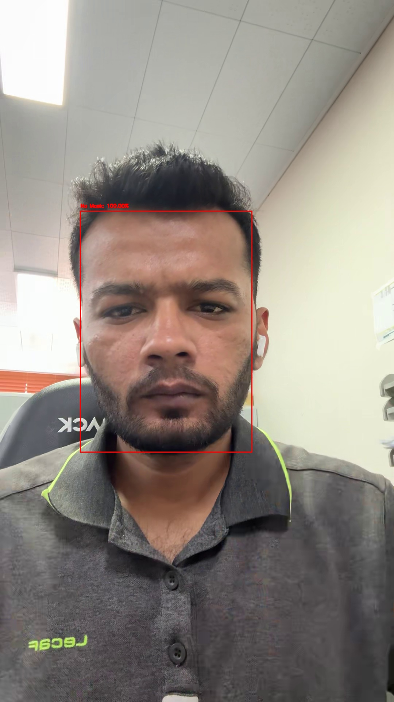

<h1 align="center">Face Mask Detection</h1>

<p align="center">
  <strong>Detect faces and classify mask vs. no mask in images and videos.</strong><br>
  Two-stage pipeline: Caffe SSD face detection + MobileNetV2 classifier.
</p>

<p align="center">
  
  
  
  
</p>

<p align="center">
  
  &nbsp;
  
</p>

<p align="center"><em>Left: person wearing a mask &nbsp;|&nbsp; Right: person without a mask</em></p>

---

## Overview

This project answers one question per detected face: **is the person wearing a face mask?**

| Capability | Supported |
|------------|-----------|
| Face detection | Yes (ResNet-10 SSD via OpenCV DNN) |
| Mask / No Mask classification | Yes (MobileNetV2 transfer learning) |
| Image inference | Yes |
| Video file inference | Yes |
| Webcam inference | Yes |
| Face recognition (who is this person?) | **No** |

> **Note:** This is **not** a face recognition system. It does not identify people or match faces to a database.

## How it works

```
Input (image / video frame)
        │
        ▼
┌───────────────────────┐
│  Face detector (SSD)  │  ← OpenCV DNN + Caffe model
└───────────┬───────────┘
            │ face crop (224×224)
            ▼
┌───────────────────────┐
│  MobileNetV2 head     │  ← Mask vs No Mask (softmax)
└───────────┬───────────┘
            ▼
   Green box = Mask
   Red box   = No Mask
```

**Model:** MobileNetV2 (ImageNet backbone) + `Dense(128)` + `Dropout` + `Dense(2, softmax)`  
**Reported accuracy:** ~93% on the original training set  
**Weights:** `mask_detector.model` (~11 MB, included in repo)

## Results

### Still images

| Input | Prediction |
|-------|------------|
|  | 2 faces → **Mask** |
|  | Mixed → **Mask** + **No Mask** |
|  | 1 face → **No Mask** |

### Real-world video frames

| Mask worn | No mask |
|-----------|---------|
|  |  |

## Quick start

### 1. Clone and install

```bash
git clone https://github.com/Sandesh1764/face-mask-detection.git
cd face-mask-detection

python3 -m venv .venv
source .venv/bin/activate        # Windows: .venv\Scripts\activate
pip install -r requirements.txt
```

### 2. Detect on an image

```bash
python detect_mask_image.py --image samples/inputs/images/pic1.jpeg
```

### 3. Detect on a video file

```bash
python detect_mask_video_file.py \
  --input path/to/video.mp4 \
  --output path/to/video_predicted.mp4
```

### 4. Webcam (real-time)

```bash
python detect_mask_video.py
# Press 'q' to quit
```

## Project structure

```
├── face_detector/              # Caffe SSD face detector weights
├── mask_detector.model         # Trained MobileNetV2 classifier
├── detect_mask_image.py        # Image inference
├── detect_mask_video_file.py   # Video file inference
├── detect_mask_video.py        # Webcam inference
├── process_user_videos.py      # Batch process + random frame snapshots
├── generate_demo_outputs.py    # Regenerate public demo assets
├── train_mask_detector.py      # Train from dataset
├── samples/                    # Curated demo inputs & outputs
└── docs/                       # README GIFs
```

## Training (optional)

Download the dataset from the [original project](https://github.com/chandrikadeb7/Face-Mask-Detection), then:

```bash
python train_mask_detector.py --dataset path/to/dataset
```

Dataset layout:

```
dataset/
├── with_mask/
└── without_mask/
```

## Requirements

- Python 3.9+
- CPU works; GPU optional (CUDA)
- ~500 MB disk for dependencies + model files

## Credits

Based on the excellent [Face-Mask-Detection](https://github.com/chandrikadeb7/Face-Mask-Detection) project by **Chandrika Deb** (PyImageSearch tutorial + MobileNetV2 approach).

This fork extends it with:
- Video file inference (`detect_mask_video_file.py`)
- User video batch processing (`process_user_videos.py`)
- Curated `samples/` and `docs/` for demos
- Updated dependencies for modern Python

## License

MIT — see [LICENSE](LICENSE). Original work © Chandrika Deb.
